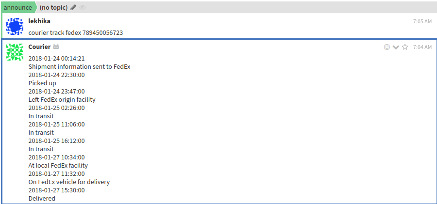

# Monitor Express

Shipment tracking Zulip Bot for Zulip realm.

## Requirements

1. Zulip
2. Aftership
3. prettyprinter

## Steps to Run

1. Install requirements using `pip3 install -r requirements.txt`
2. Create a zulip realm on [https://zulipchat.com](https://zulipchat.com)
    - Create a Bot on zulip.
    - Go to settings from the gear menu in the top right corner.
    - Create a new generic bot from `Your bots`.
    - Download the bot's zuliprc and save it in your home directory as `.zuliprc`.
3. Run the Bot using `python3 bot.py`.

## Usage

1. The format for the bot query is `courier track <company name> <tracking number>`
2. First and second word of the messsage should be `courier track`.
3. Third word should be the courier company name.
4. Fourth word should be courier Tracking number.

